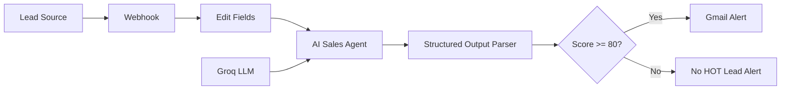

# AI Sales Lead Qualification Automation with n8n

## Overview

This project is a GitHub-ready portfolio/demo version of an AI-powered sales lead qualification automation built with n8n. It accepts a new lead through a webhook, normalizes the lead data, asks an AI agent to score and classify the opportunity, and sends a Gmail alert only when the lead is qualified as HOT.

## Features

- Webhook-based lead intake using `POST /new-sales-lead`
- Clean field mapping for lead name, company, students, budget, and message
- AI scoring with explicit qualification rules
- Structured JSON output from the AI Agent
- HOT/WARM/COLD lead classification
- Gmail notification only for leads with `lead_score >= 80`
- Demo-safe workflow export with no API keys, OAuth tokens, passwords, or credential secrets

## Architecture



## Workflow

1. A lead source sends a `POST` request to the n8n webhook.
2. The Edit Fields node maps the incoming request body into clean fields.
3. The AI Agent qualifies the lead using the scoring rules.
4. Groq runs the `openai/gpt-oss-120b` chat model.
5. The Structured Output Parser returns a predictable JSON object.
6. The IF node checks whether `lead_score >= 80`.
7. The TRUE branch sends a Gmail notification for HOT leads.
8. The FALSE branch does not send the same HOT-lead email.

## Lead Scoring Logic

- Clear requirement: `+25`
- Budget mentioned: `+25`
- Wants demo/call: `+30`
- Clear urgency/timeline: `+20`

Classification:

- `80-100`: HOT
- `50-79`: WARM
- Below `50`: COLD

## Tech Stack

- n8n
- Groq
- GPT-OSS-120B
- n8n AI Agent
- Structured Output Parser
- Gmail OAuth2
- Webhook
- Docker

## Project Structure

```text
n8n-ai-sales-lead-automation/
├── workflow/
│   └── ai-sales-lead-automation.json
├── examples/
│   └── sample-lead.json
├── screenshots/
│   └── .gitkeep
├── README.md
└── .gitignore
```

## Prerequisites

- n8n running locally or in a hosted environment
- A Groq account and API credential configured in n8n
- A Gmail OAuth2 credential configured in n8n
- Docker, if you run n8n locally with Docker

## n8n Setup

If you run n8n locally with Docker, start your n8n instance and open:

```text
http://localhost:5678
```

Create or connect the required credentials inside n8n before activating the workflow.

## Import Workflow

1. Open n8n.
2. Create a new workflow.
3. Choose **Import from File**.
4. Select `workflow/ai-sales-lead-automation.json`.
5. Review each node after import.
6. Reconnect the Groq and Gmail credentials in your own n8n instance.

## Configure Groq Credentials

In n8n, create a Groq credential and connect it to the `Groq Chat Model` node. This demo workflow references a placeholder credential named `Groq account` and does not include any API key.

The model is configured as:

```text
openai/gpt-oss-120b
```

## Configure Gmail OAuth

In n8n, create a Gmail OAuth2 credential and connect it to the `Send a message` node. This demo workflow references a placeholder credential named `Gmail account` and does not include OAuth access tokens, refresh tokens, client secrets, or passwords.

Update the recipient address from:

```text
your-email@example.com
```

to the address that should receive HOT lead notifications.

## Testing the Webhook

Use the test webhook URL while the workflow is open in n8n test mode:

```bash
curl -X POST http://localhost:5678/webhook-test/new-sales-lead \
  -H "Content-Type: application/json" \
  -d '{
    "name": "Amit Patel",
    "company": "Bright Future School",
    "students": 650,
    "budget": 6000,
    "message": "We need attendance and fee reminder automation and want a demo this week."
  }'
```

`/webhook-test/` is used when manually testing a workflow in the n8n editor. After the workflow is active, use the production webhook path:

```text
http://localhost:5678/webhook/new-sales-lead
```

## Example Input

```json
{
  "name": "Amit Patel",
  "company": "Bright Future School",
  "students": 650,
  "budget": 6000,
  "message": "We need attendance and fee reminder automation and want a demo this week."
}
```

## Example AI Output

```json
{
  "lead_score": 100,
  "lead_status": "HOT",
  "requirement": "Attendance and fee reminder automation",
  "reason": "Clear requirement, budget, demo request and timeline provided",
  "next_action": "Schedule a demo call"
}
```

## Security Notes

- No Groq API keys are included.
- No Gmail OAuth access tokens or refresh tokens are included.
- No Google Client ID or Client Secret is included.
- No passwords or n8n credential secrets are included.
- Demo recipient email addresses use `your-email@example.com`.
- Review exported n8n workflows before publishing them because local exports can include credential references.

## Future Improvements

- Add CRM integration for qualified leads.
- Store all leads in Google Sheets, Airtable, or a database.
- Send WARM leads to a nurture sequence.
- Add lead source tracking and campaign attribution.
- Add Slack or Teams notifications for HOT leads.
- Add screenshots of the imported workflow to the `screenshots/` directory.
